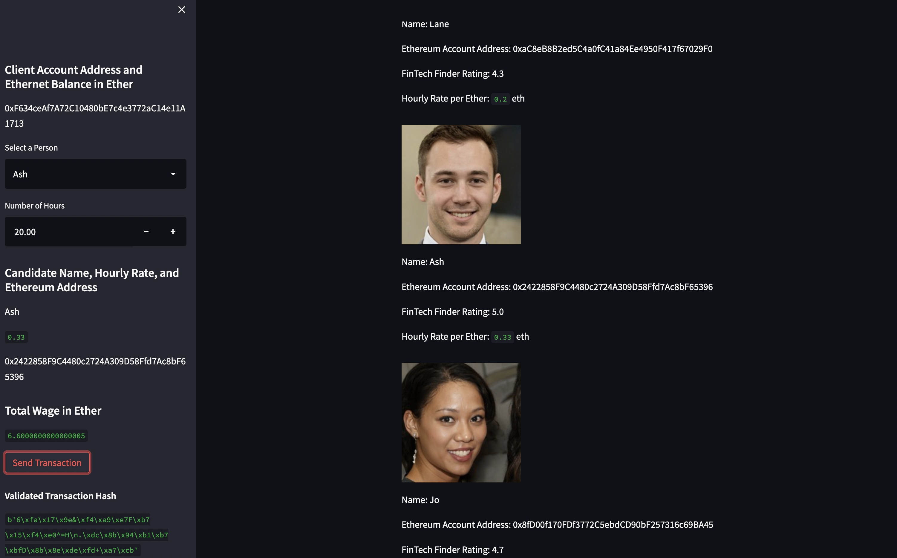
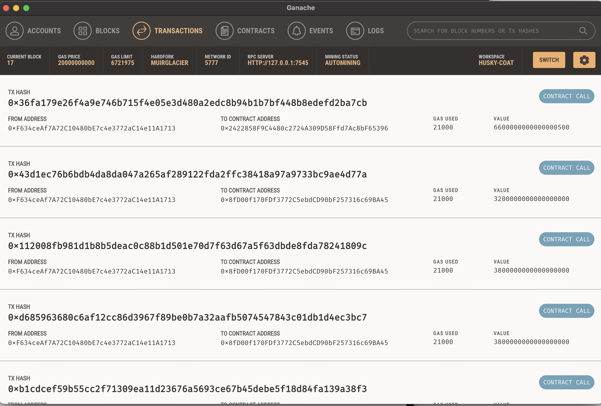
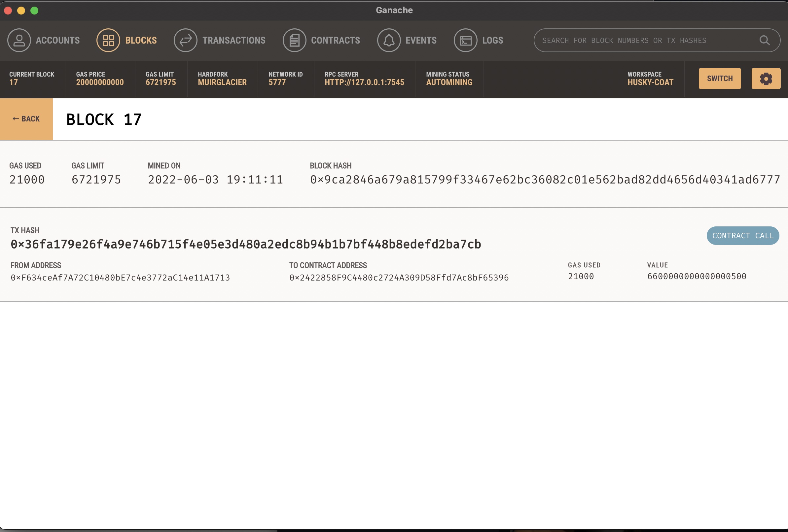

# Module 19 Challange

## Sending Transaction to Ganache using Streamlit

### Pete Petersen

### 06/03/2022  


## Overview

Fintech Finder is an application that its customers can use to find fintech professionals from among a list of candidates, hire them, and pay them. As Fintech Finder’s lead developer, you have been tasked with integrating the Ethereum blockchain network into the application in order to enable your customers to instantly pay the fintech professionals whom they hire with cryptocurrency.  

## Screenshot of working application with transaction hash displayed



## Screenshot of transaction history to Fintech pro wallets

  

## Screenshot of wallet balances

**Note:  The mnemonic display in this Ganache account screenshot was also utilized in the application by also storing the mnemomic in .env and return the values from the OS using load_dotenv() and os packages**

  

## Screenshot of transaction on a mined block

  

## crypo_wallet.py

**crypto_wallet.py** is a python script the houses the main functions ( generate_account, get_balance, send_transaction )used by the app.py and has the following dependancies.

```python

#####################################################################
# Imports
import os
import requests
from dotenv import load_dotenv

load_dotenv()
from bip44 import Wallet
from web3 import Account
from web3 import middleware
from web3.gas_strategies.time_based import medium_gas_price_strategy

#####################################################################
```

## fintech_finder.py

**fintech_finder.py** is a python script the builds the user ineteface using streamlit.  The streamlit application import the wallet operations function from **crypto_wallet.py**

```python

#####################################################################
# Imports
import streamlit as st
from dataclasses import dataclass
from typing import Any, List
from web3 import Web3
# w3 provider is the ganache services running on local host
w3 = Web3(Web3.HTTPProvider("HTTP://127.0.0.1:7545"))

# export the main function from crypto_wallet.py
from crypto_wallet import generate_account, get_balance, send_transaction
#####################################################################
```

*The application was tested using Ganache Version 2.5.4 (2.5.4.1367)*
